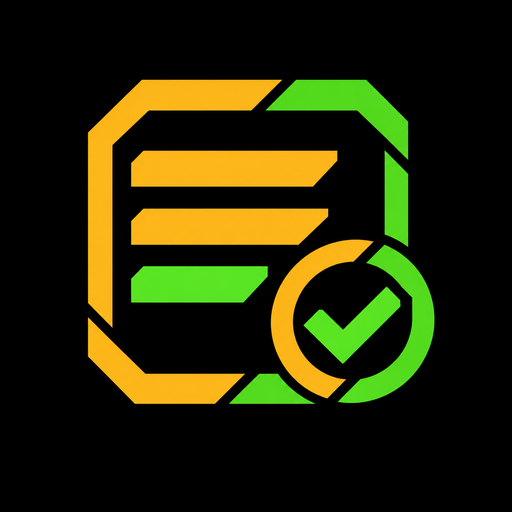
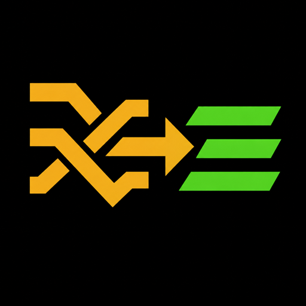

# MikeVan's AI Development Toolkit

"Your AI writes the code. These three tools tell you whether to trust it."

![MikeVan's AI Development Toolkit in action: checkpoint, check, untangle, check again]

MikeVan's AI Development Toolkit is one install that puts KeepSafe, DeepTest, and UntangleIt in your editor together. KeepSafe is the undo button. DeepTest is the inspector. UntangleIt is the fixer. You make every decision; the tools measure, remember, untangle, and report.

### Why the Toolkit

- **One install, three tools**: KeepSafe, DeepTest, and UntangleIt arrive together and work together.
- **Plain words first**: Every screen is written for someone who does not read code line by line. The engineer's numbers sit behind one switch.
- **You decide, always**: No tool changes your code on its own, and no tool accepts an AI's result on your behalf.
- **Undo built in**: Before any tool hands work to your AI assistant, it offers a KeepSafe checkpoint.
- **Your own tests, your own runtime**: DeepTest and UntangleIt run the test runner your project already has. Nothing extra to install.
- **100% local**: Checkpoints, decisions, and results stay in your workspace.

### The Toolkit + Your AI Assistant: Partners in Protection

"The assistant writes. The Toolkit checks. You sign."

Your assistant can produce a thousand lines before lunch. The Toolkit tells you which of those lines no test has ever reached, which functions are too tangled to trust, and how to get a working version back when a fix goes wrong.

### Workflow

**Checkpoint → Prompt → Check → Fix or Accept → Check again**

### Quick Start

1. Install MikeVan's AI Development Toolkit from the VS Code Marketplace.
2. Open the DeepTest panel and select Check my code.
3. Read the verdict. On the hardest function, select Fix this, choose Break it into smaller pieces, take the KeepSafe checkpoint when offered, and let UntangleIt untangle it.
4. Select Check my code again. Keep the result, or restore the checkpoint.

---

## The Tools

**KeepSafe** remembers and restores. One-click checkpoints of the whole workspace before your assistant touches it, fast restore of thousands of files at once, and diffs between any two checkpoints. Git protects your project history; KeepSafe protects you from the last prompt.

 

**DeepTest** measures and judges. It runs your tests, then reports in plain words which lines no test has ever reached, how many tests each line needs given the decisions guarding it, and which functions are harder to test than your limit. Every shortfall is a card with three choices: Fix this, Accept as it is, or Leave for now. DeepTest never fixes anything itself and never accepts a fix on your behalf.

 

**UntangleIt** untangles. Point it at the function DeepTest flagged and it splits that function into pieces that do exactly the same thing, each within your limit. Then it runs your tests and measures every piece again. An assistant that says "done" is not evidence; the numbers are.
 

### How They Work Together

- DeepTest's "Break it into smaller pieces" hands the job to UntangleIt when UntangleIt is installed.
- Both offer a KeepSafe checkpoint before any hand-off, and the restore afterwards.
- Every tool is a separate extension. Uninstall one and the others keep working; they recommend the missing one once, on their setup screen, and never nag.

### The Numbers, for Those Who Want Them

Every function gets three numbers, computed by one shared library so the tools never disagree about the same function:

| Number | What it answers | Source |
|--------|-----------------|--------|
| **Ways through** | How many paths must the tests reach? | Cyclomatic complexity, McCabe 1976 |
| **Tangle (Campbell)** | How hard is this to follow, reading a boolean chain as one idea? | Cognitive Complexity, SonarSource 2018 |
| **Tangle (MBCC)** | How hard is this to follow when the code will not let you read the chain as one idea? | MikeVan's Better Cognitive Complexity, Project Revive Solutions 2026 |

MBCC charges a chain of `and`/`or` one per operand when the order of the operands carries meaning: `m is not None and m.dues is not None and m.dues.paid` costs 3, not 1, because you have to trace it left to right to understand it. The charge is on the code, not on the reader.

---

## Commands

| Command | Tool | Function |
|---------|------|----------|
| **Quick Checkpoint** | KeepSafe | Timestamped workspace snapshot |
| **Restore Latest Checkpoint** | KeepSafe | Rollback to the most recent checkpoint |
| **Diff Checkpoints** | KeepSafe | Display changes between two checkpoints |
| **Check my code** | DeepTest | Run the tests and report the verdict |
| **Tell me where the tests are** | DeepTest | Open the setup screen |
| **Find the tangled methods** | UntangleIt | Measure every method and list the ones over your limit |
| **Untangle this method** | UntangleIt | Untangle one method, with the gates |
| **Untangle the most tangled method** | UntangleIt | Untangle the worst method in the workspace |
| **Measure the method again** | UntangleIt | Re-measure after your assistant's work |

---

## Languages

TypeScript and JavaScript (Jest or Vitest) and Python (pytest). Java, C#, and C++ are next, then PHP or Go.

---

## Requirements

Visual Studio Code 1.104.0 or newer. Docker is needed only if your own test suite needs it.

---

**License:** GPL-3.0-only. Published by Project Revive Solutions, LLC, https://projectrevivesolutions.com.
